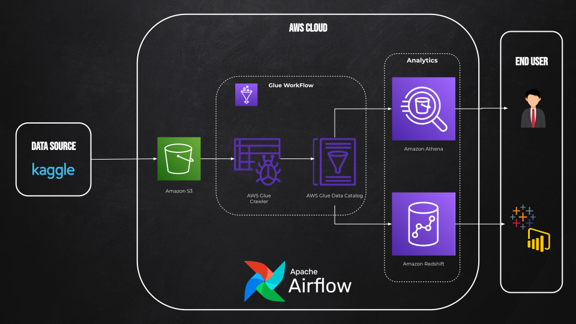

# Data Processing & Analytics Pipeline with AWS and Airflow

This repository outlines a data processing and analytics pipeline leveraging AWS services and Apache Airflow. The main objective is to automate the process of fetching data, storing it in AWS, processing with Glue and Athena, and preparing it for visualization.

## Dataset Source

The data used in this pipeline is sourced from Kaggle, specifically the [Telco Customer Churn (IBM) Dataset](https://www.kaggle.com/datasets/yeanzc/telco-customer-churn-ibm-dataset?resource=download).

## Use Cases

### Data Querying with Athena

Once the data has been processed and stored, analysts or other data professionals can directly query the dataset using Amazon Athena. This provides a serverless interactive query service that simplifies the analysis of data in Amazon S3 using standard SQL. Analysts can use Athena to generate insights, build reports, or create datasets for further use.

### Data Visualization

While this pipeline does not directly include a dashboard, it prepares the data in such a way that it can easily be connected to visualization tools like Tableau, PowerBI, or other reporting tools. Users can connect to the data stored in Amazon Redshift or directly from Athena to build visual reports and dashboards. This flexibility allows organizations to pick a visualization tool that best fits their needs and expertise.

## Diagram Overview



1. **Data Download**: Source data from the Internet.
2. **Amazon S3**: Store data in an S3 bucket.
3. **AWS Glue Crawler**: Extract schema and create metadata tables.
4. **Amazon Athena**: Query data directly from S3.
5. **Amazon Redshift**: Store processed data for complex analytics.

## Code Structure

- Apache Airflow DAG: Automates data transfer from S3 to Redshift using AWS Glue.

### Workflow:

1. Trigger the AWS Glue job to transfer data from S3 to Redshift.
2. Fetch the Glue job's run ID.
3. Monitor the Glue job's status using a sensor.

## Getting Started

### Prerequisites

Before deploying this solution, ensure you've covered the following steps:

1. **AWS Glue Crawler Setup**: Set up an AWS Glue Crawler for your dataset. This crawler scans your data source and populates the AWS Glue Data Catalog with table definitions. [Refer to the official AWS documentation](https://docs.aws.amazon.com/glue/latest/dg/add-crawler.html) for setup instructions.

2. **Connection Between Airflow and Amazon**:
    - Navigate to the Airflow web interface.
    - Under the "Admin" tab, select "Connections".
    - Add a new connection with your AWS credentials (`aws_access_key_id` and `aws_secret_access_key`).
    - Set the connection type to 'Amazon Web Services'. Name it `aws_s3_conn` or update the DAG to match your connection name.

3. **Connecting AWS Glue with Amazon Redshift**:
    - In AWS Glue, navigate to "Connections" under the "Data catalog" section.
    - Choose “Add connection”, provide a suitable name.
    - Select Amazon Redshift as the connection type.
    - Enter the necessary Redshift cluster details and credentials.
    - Test the connection to ensure everything's set up correctly.
    - Use this connection in your Glue jobs for loading data into Redshift.

4. **Other Setup**:
    - **Amazon S3 Bucket**: Create an S3 bucket where your data will be stored temporarily during the ETL process. Make sure the permissions are set appropriately for AWS Glue to access and write to this bucket.
    - **Amazon Redshift Cluster**: If you don’t already have an Amazon Redshift cluster, [follow this guide](https://docs.aws.amazon.com/redshift/latest/gsg/rs-gsg-launch-sample-cluster.html) to create one. Ensure the security group rules allow access from AWS Glue and your analytics tools (e.g., Tableau, PowerBI).
    - **IAM Roles**: Ensure that the role associated with AWS Glue has the necessary permissions for Amazon S3, AWS Glue, and Amazon Redshift. The role should have policies that allow reading from the source location, writing to the destination, and executing Glue jobs.

By following these steps, you'll be ready to use the provided DAG for your ETL tasks seamlessly.

### Installation

1. Clone the repository:
   ```bash
   git clone https://github.com/pjvillasista/customer-churn-aws-ETL/
   ```

2. Configure your AWS credentials:
   ```bash
   aws configure
   ```

3. Set up your Apache Airflow environment.

4. Place the DAG in your Airflow DAGs directory.

### Usage

1. Start the Airflow web server:
   ```bash
   airflow webserver
   ```

2. Trigger the DAG from the Airflow UI.

3. Once data is processed and saved in Redshift, use PowerBI to connect to your Redshift cluster for visualization.

## Contributing

If you'd like to contribute to this project, please fork the repository, create your feature branch, commit your changes, and open a pull request.
